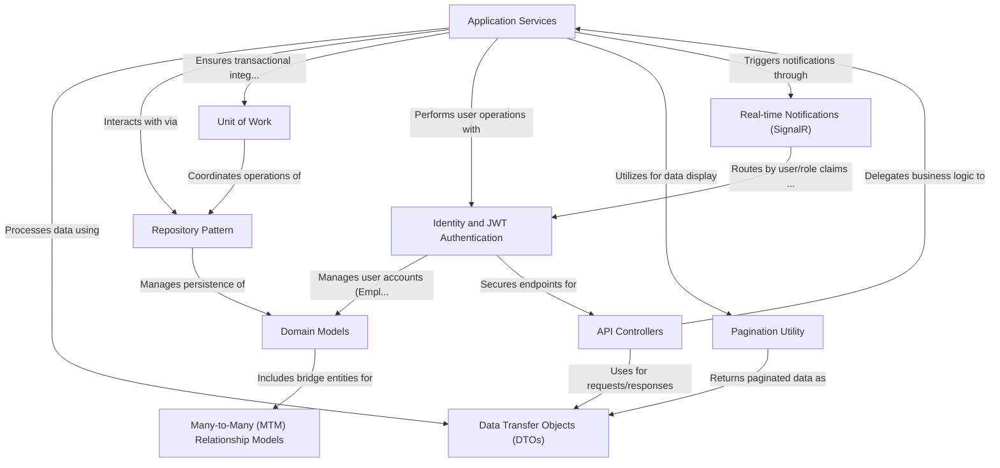

# Tutorial: Dunes_Agent_API

This project is an **Agent API** for managing a business focused on **tourism and hospitality**, likely for hotels and tour operations. It handles core functionalities such as **employee management**, **hotel and location administration**, **service offerings**, **currency exchanges**, and **booking/receipt voucher processing**. The API ensures secure access through *authentication*, maintains data integrity with *transactional consistency*, and improves user experience with *pagination* for large data and *real-time notifications* for critical updates.

## Visual Overview

## Chapters

1. [Domain Models
](01_domain_models_.md)
2. [Many-to-Many (MTM) Relationship Models
](02_many_to_many__mtm__relationship_models_.md)
3. [Data Transfer Objects (DTOs)
](03_data_transfer_objects__dtos__.md)
4. [Repository Pattern
](04_repository_pattern_.md)
5. [Unit of Work
](05_unit_of_work_.md)
6. [Identity and JWT Authentication
](06_identity_and_jwt_authentication_.md)
7. [Application Services
](07_application_services_.md)
8. [Pagination Utility
](08_pagination_utility_.md)
9. [API Controllers
](09_api_controllers_.md)
10. [Real-time Notifications (SignalR)
](10_real_time_notifications__signalr__.md)

---

Generated by [AI Codebase Knowledge Builder](https://github.com/The-Pocket/Tutorial-Codebase-Knowledge).
