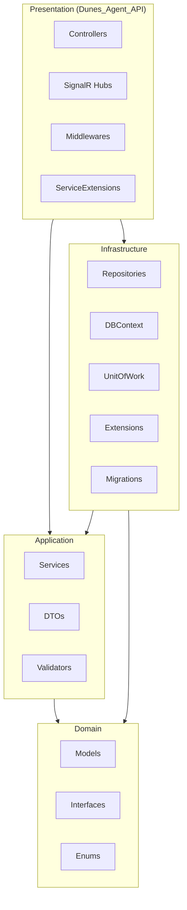
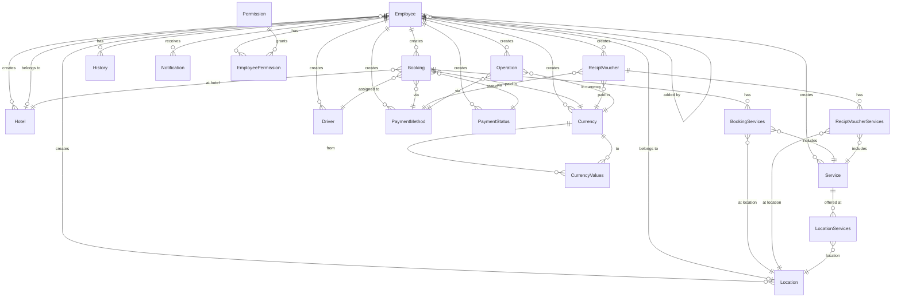
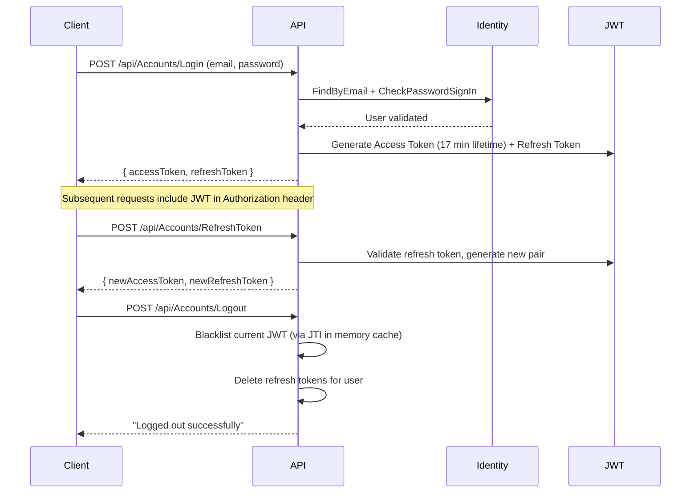

# Dunes Agent API — Full Codebase Documentation

## 1. Project Purpose & Overview

**Dunes Agent API** is a **back-office management system for a tourism/travel agency** (likely based in the UAE). It serves as the backend API powering an internal control panel used by employees of different roles to manage the day-to-day operations of a travel/tour agency business.

### Core Business Functions

| Function | Description |
|---|---|
| **Booking Management** | Create, track, and manage guest bookings — including driver assignment, hotel, pick-up scheduling, services, pricing (VAT, discounts, net profit), payment method/status, and confirmation |
| **Receipt Voucher Management** | Generate and manage receipt vouchers for guests with services, pricing, agent name, and confirmation tracking |
| **Financial Operations** | Track income and outcome operations with currency and payment method, feeding into a financial analysis summary (NetProfit, TotalIncome, TotalOutcome) |
| **Service Catalog** | Define and manage tourism services (e.g., excursions, tours) with duration, type, and linked locations |
| **Hotel & Location Management** | Manage hotels and locations where services are offered; employees can belong to specific hotels/locations |
| **Driver Management** | Manage a pool of drivers (name, phone, car number, place of work) assigned to bookings |
| **Currency & Exchange Rates** | Manage multiple currencies and their exchange rates between each other |
| **Payment Processing** | Manage payment methods (cash, card, etc.) and payment statuses (paid, pending, etc.) |
| **Employee Management** | Register employees, manage profiles (salary type, commission, UAE status, visa counts), assign to hotels/locations |
| **Role-Based Access Control** | Four roles: `Admin`, `OperationManager`, `DeskAgent`, `TourAgent` with granular module-level permissions |
| **Real-Time Notifications** | Push notifications to employees via SignalR based on their role or user ID |
| **Audit History** | Track who performed what operation and when |

---

## 2. Architecture

The solution follows **Clean Architecture** (also known as Onion Architecture) with **4 projects**:



### Layer Responsibilities

| Layer | Project | Purpose |
|---|---|---|
| **Domain** | `Domain/` | Core entities, enums, and repository interfaces — zero external dependencies (except EF Core for model configuration) |
| **Application** | `Application/` | Business logic services, DTOs, validators — depends only on Domain |
| **Infrastructure** | `Infrastructure/` | EF Core DbContext, generic repository, Unit of Work, migrations — implements Domain interfaces |
| **Presentation** | `Dunes_Agent_API/` | ASP.NET Core Web API controllers, middlewares, SignalR hubs, DI setup — the entry point |

---

## 3. Technology Stack

| Technology | Version | Purpose |
|---|---|---|
| **.NET** | 8.0 | Runtime framework |
| **ASP.NET Core** | 8.0 | Web API framework |
| **Entity Framework Core** | 9.0.10 | ORM / Database access |
| **SQL Server** | — | Primary database |
| **ASP.NET Core Identity** | 8.0 | Authentication & user management |
| **JWT Bearer Tokens** | — | API authentication |
| **SignalR** | 1.2.0 | Real-time WebSocket notifications |
| **Serilog** | 9.0.0 | Structured logging |
| **FluentValidation** | 12.0.0 | Request validation |
| **Swashbuckle** | 9.0.6 | Swagger / OpenAPI documentation |
| **Newtonsoft.Json** | 13.0.1 | JSON serialization |

---

## 4. Domain Models & Relationships

### 4.1 Entity Relationship Diagram



### 4.2 Core Entities

#### [Employee](file:///d:/WebDev/Backend/Api's/Dunes_Agent_API/Domain/Models/Accounts/Employee.cs) (extends `IdentityUser`)
The central user entity. Employees are the system's users with role-based access.

| Field | Type | Description |
|---|---|---|
| `JoinDate` | DateTime | When the employee joined |
| `IsFromUAE` | bool | Whether the employee is from UAE |
| `HasControlSystemAccess` | bool | Whether they can access the control system |
| `SalaryType` | Enum | `SalaryOnly`, `CommisionOnly`, or `Salary_and_Commision` |
| `SalaryValue` | decimal | Salary amount |
| `CommissionRate` | decimal | Commission percentage |
| `StaffVisaCount` | decimal | Number of staff visas |
| `HotelId` | Guid? | Hotel the employee belongs to |
| `LocationId` | Guid? | Location the employee belongs to |
| `EmployeeAddedId` | string? | Who added this employee (self-referencing) |

#### [Booking](file:///d:/WebDev/Backend/Api's/Dunes_Agent_API/Domain/Models/Booking.cs)
Represents a guest booking/reservation. The core transactional entity.

| Field | Type | Description |
|---|---|---|
| `GuestName` | string | Guest's name |
| `PhoneNumber` | string | Guest's phone number |
| `Room` | string? | Room number |
| `PickUpStatus` | string? | Pickup status |
| `TicketNumber` | string? | Ticket number |
| `OrderNumber` | string? | Order number |
| `PickUpDate` | DateTime | Scheduled pickup date |
| `IsConfirmed` | bool | Whether booking is confirmed |
| `VATPercentage` | decimal | VAT percentage |
| `TotalPriceBeforeDiscount` | decimal | Price before discount |
| `DiscountPercentage` | decimal | Discount percentage |
| `TotalPriceAfterDiscount` | decimal | Price after discount |
| `NetProfit` | decimal | Net profit from this booking |

#### [ReciptVoucher](file:///d:/WebDev/Backend/Api's/Dunes_Agent_API/Domain/Models/ReciptVoucher.cs)
A receipt voucher issued for guest services.

| Field | Type | Description |
|---|---|---|
| `GuestName` | string | Guest's name |
| `AgentName` | string | Agent's name |
| `TotalPrice` | decimal | Total price |
| `PickupDate` | DateTime | Pickup date |
| `NumberOfRooms` | string? | Number of rooms |
| `IsConfirmed` | bool | Confirmation status |
| `Notes` | string? | Additional notes |

#### [Service](file:///d:/WebDev/Backend/Api's/Dunes_Agent_API/Domain/Models/Service.cs)
Represents a tourism service offered by the agency.

| Field | Type | Description |
|---|---|---|
| `ServiceName` | string | Name of the service |
| `Duration` | int | Duration value |
| `TimeDuration` | Enum | Unit: `Hours`, `Minutes`, `Seconds` |
| `Type` | string? | Service type/category |
| `Description` | string? | Service description |

#### [Operation](file:///d:/WebDev/Backend/Api's/Dunes_Agent_API/Domain/Models/Operation.cs)
A financial operation (income or outcome).

| Field | Type | Description |
|---|---|---|
| `OperationName` | string | Name of the operation |
| `Type` | Enum | `Income` or `Outcome` |
| `Value` | decimal | Monetary value |

#### [Analysis](file:///d:/WebDev/Backend/Api's/Dunes_Agent_API/Domain/Models/Analysis.cs)
Financial summary/dashboard data.

| Field | Type | Description |
|---|---|---|
| `NetProfit` | decimal | Income minus Outcome |
| `TotalIncome` | decimal | Sum from operations, bookings, vouchers |
| `TotalOutcome` | decimal | Sum from outcome operations |
| `LastUpdateDate` | DateTime | Last computation time |

#### Other Entities

| Entity | File | Purpose |
|---|---|---|
| [Hotel](file:///d:/WebDev/Backend/Api's/Dunes_Agent_API/Domain/Models/Hotel.cs) | Hotel management (Name, Place) |
| [Location](file:///d:/WebDev/Backend/Api's/Dunes_Agent_API/Domain/Models/Location.cs) | Location management (Name, Place) |
| [Driver](file:///d:/WebDev/Backend/Api's/Dunes_Agent_API/Domain/Models/Driver.cs) | Driver management (Name, Phone, CarNumber, PlaceOfWork) |
| [Currency](file:///d:/WebDev/Backend/Api's/Dunes_Agent_API/Domain/Models/Currency.cs) | Currency management with exchange rate pairs |
| [PaymentMethod](file:///d:/WebDev/Backend/Api's/Dunes_Agent_API/Domain/Models/PaymentMethod.cs) | Payment methods (cash, card, etc.) |
| [PaymentStatus](file:///d:/WebDev/Backend/Api's/Dunes_Agent_API/Domain/Models/PaymentStatus.cs) | Payment statuses (paid, pending, etc.) |
| [Notification](file:///d:/WebDev/Backend/Api's/Dunes_Agent_API/Domain/Models/Notification.cs) | In-app notifications with read status |
| [History](file:///d:/WebDev/Backend/Api's/Dunes_Agent_API/Domain/Models/History.cs) | Audit log of employee actions |
| [Permission](file:///d:/WebDev/Backend/Api's/Dunes_Agent_API/Domain/Models/Permission.cs) | Module/Action permission definitions |

### 4.3 Many-to-Many Join Tables

| Join Table | Connects | Purpose |
|---|---|---|
| `BookingServices` | Booking ↔ Service ↔ Location | Services included in a booking, with price per service and per-location pricing |
| `ReciptVoucherServices` | ReciptVoucher ↔ Service ↔ Location | Services included in a receipt voucher |
| `LocationServices` | Location ↔ Service | Which services are available at which locations (with price) |
| `CurrencyValues` | Currency ↔ Currency | Exchange rates between currencies |
| `EmployeePermission` | Employee ↔ Permission | Which employees have which permissions |

### 4.4 Enums

| Enum | File | Values |
|---|---|---|
| [OpreationType](file:///d:/WebDev/Backend/Api's/Dunes_Agent_API/Domain/Enums/OpreationType.cs) | `Income = 1`, `Outcome = 2` |
| [SalaryType](file:///d:/WebDev/Backend/Api's/Dunes_Agent_API/Domain/Enums/SalaryType.cs) | `SalaryOnly = 1`, `CommisionOnly = 2`, `Salary_and_Commision = 3` |
| [TimeDuration](file:///d:/WebDev/Backend/Api's/Dunes_Agent_API/Domain/Enums/TimeDuration.cs) | `Hours = 1`, `Minutes = 2`, `Seconds = 3` |

---

## 5. API Endpoints

### 5.1 Accounts ([AccountsController](file:///d:/WebDev/Backend/Api's/Dunes_Agent_API/Dunes_Agent_API/Controllers/AccountsController.cs))

| Method | Route | Auth | Description |
|---|---|---|---|
| `POST` | `/api/Accounts/Login` | Anonymous | Login with email/password, returns JWT + refresh token |
| `POST` | `/api/Accounts/RefreshToken` | Anonymous | Exchange a refresh token for new access + refresh tokens |
| `POST` | `/api/Accounts/Logout` | Authorized | Blacklists the current JWT, deletes refresh tokens |
| `POST` | `/api/Accounts/AddEmployee` | Authorized | Register a new employee |
| `GET` | `/api/Accounts/GetAllEmployeesPaginated` | — | Paginated employee list with filters (name, position, phone) |
| `GET` | `/api/Accounts/GetEmployeeById/{id}` | — | Get employee details by ID |
| `PATCH` | `/api/Accounts/PatchEmployee/{id}` | — | Partially update an employee |

### 5.2 Currencies ([CurrenciesController](file:///d:/WebDev/Backend/Api's/Dunes_Agent_API/Dunes_Agent_API/Controllers/CurrenciesController.cs))

| Method | Route | Description |
|---|---|---|
| `POST` | `/api/Currencies/AddNewCurrency` | Add a new currency |
| `PATCH` | `/api/Currencies/UpdateCurrency/{Id}` | Update a currency |
| `DELETE` | `/api/Currencies/DeleteCurrency/{Id}` | Soft-delete a currency |
| `GET` | `/api/Currencies/GetAllCurrencies` | Get all currencies |
| `GET` | `/api/Currencies/GetAllCurruncicesPaginated` | Paginated currencies with filters |
| `GET` | `/api/Currencies/GetCurrencyDetails/{Id}` | Get currency details |
| `GET` | `/api/Currencies/GetCurrencyBookingsCountPaginated` | Count of bookings per currency |
| `GET` | `/api/Currencies/GetCurrencyVouchersCountPaginated` | Count of vouchers per currency |
| `GET` | `/api/Currencies/GetCurrencyOpreationsCountPaginated` | Count of operations per currency |

### 5.3 Other Controllers

| Controller | File | CRUD Operations |
|---|---|---|
| [CurrencyValuesController](file:///d:/WebDev/Backend/Api's/Dunes_Agent_API/Dunes_Agent_API/Controllers/CurrencyValuesController.cs) | Exchange rate CRUD |
| [DriverController](file:///d:/WebDev/Backend/Api's/Dunes_Agent_API/Dunes_Agent_API/Controllers/DriverController.cs) | Driver CRUD with pagination |
| [HotelController](file:///d:/WebDev/Backend/Api's/Dunes_Agent_API/Dunes_Agent_API/Controllers/HotelController.cs) | Hotel CRUD with pagination |
| [LocationController](file:///d:/WebDev/Backend/Api's/Dunes_Agent_API/Dunes_Agent_API/Controllers/LocationController.cs) | Location CRUD with pagination |
| [PaymentMethodController](file:///d:/WebDev/Backend/Api's/Dunes_Agent_API/Dunes_Agent_API/Controllers/PaymentMethodController.cs) | Payment method CRUD with pagination |
| [PaymentStatusController](file:///d:/WebDev/Backend/Api's/Dunes_Agent_API/Dunes_Agent_API/Controllers/PaymentStatusController.cs) | Payment status CRUD |
| [ServicesController](file:///d:/WebDev/Backend/Api's/Dunes_Agent_API/Dunes_Agent_API/Controllers/ServicesController.cs) | Service CRUD with pagination & sorting |
| [ReceiptVouchersController](file:///d:/WebDev/Backend/Api's/Dunes_Agent_API/Dunes_Agent_API/Controllers/ReceiptVouchersController.cs) | Voucher CRUD with pagination & filtering |
| [PermissionsController](file:///d:/WebDev/Backend/Api's/Dunes_Agent_API/Dunes_Agent_API/Controllers/PermissionsController.cs) | Employee permission management |
| [NotificationsController](file:///d:/WebDev/Backend/Api's/Dunes_Agent_API/Dunes_Agent_API/Controllers/NotificationsController.cs) | Notification management |

---

## 6. Authentication & Authorization

### 6.1 Authentication Flow



### 6.2 JWT Configuration
- **Issuer/Audience**: `http://localhost:7165`
- **Token Lifetime**: 17 minutes
- **Signing Key**: HMAC-SHA symmetric key
- **Validation**: Issuer, audience, lifetime, signing key — all validated with zero clock skew

### 6.3 Token Blacklisting
A custom middleware ([TokensBlacklistMiddleware](file:///d:/WebDev/Backend/Api's/Dunes_Agent_API/Dunes_Agent_API/MiddleWares/TokensBlacklistMiddleware.cs)) intercepts every request to check if the JWT's `jti` claim is in an in-memory blacklist. Blacklisted tokens are rejected with 401.

### 6.4 Role-Based Access Control
Defined in [RoleConstants](file:///d:/WebDev/Backend/Api's/Dunes_Agent_API/Domain/Models/Accounts/RoleConstants.cs):

| Role | Purpose |
|---|---|
| `Admin` | Full system access |
| `OperationManager` | Manages operations and business logic |
| `DeskAgent` | Front desk operations |
| `TourAgent` | Tour-related operations |

Roles are seeded on application startup via [SeedRolesHelper](file:///d:/WebDev/Backend/Api's/Dunes_Agent_API/Dunes_Agent_API/ServiceExtensions/SeedRolesHelper.cs).

### 6.5 Granular Permissions
Beyond roles, a fine-grained permission system exists via the [Permission](file:///d:/WebDev/Backend/Api's/Dunes_Agent_API/Domain/Models/Permission.cs) entity:
- **Module**: `booking`, `employee`, `service`, `recipt voucher`
- **Action**: `show`, `add`, `edit`, `delete`

Permissions are linked to employees via the `EmployeePermission` join table.

---

## 7. Infrastructure Patterns

### 7.1 Generic Repository Pattern
[Repository\<T>](file:///d:/WebDev/Backend/Api's/Dunes_Agent_API/Infrastructure/Repositories/Repository.cs) provides a generic data access layer with:
- `GetByIdAsync`, `GetAllAsync`, `GetFirstOrDefaultAsync`
- `GetPagedAsync` — server-side pagination with predicate filtering and sorting
- `AddAsync`, `UpdateAsync`, `PatchAsync`, `DeleteAsync`
- `Sort()` — dynamic column-based sorting via [ExtensionMethods](file:///d:/WebDev/Backend/Api's/Dunes_Agent_API/Infrastructure/Extensions/ExtensionMethods.cs) (reflection-based `OrderBy`)
- `Search()` — predicate-based filtering

### 7.2 Unit of Work Pattern
[UnitOfWork](file:///d:/WebDev/Backend/Api's/Dunes_Agent_API/Infrastructure/UnitOfWork/UnitOfWork.cs) wraps database transactions:
- `BeginTransactionAsync()` — start a DB transaction
- `CommitAsync()` — save changes and commit
- `RollbackAsync()` — rollback on failure
- `SaveChangesAsync()` — persist changes without explicit transaction

### 7.3 Specialized Repositories
Model-specific repositories extend the generic repository for custom queries (e.g., `AccountsRepo`, `HotelRepo`, `CurrencyRepo`, etc.), registered in [ServiceCollection](file:///d:/WebDev/Backend/Api's/Dunes_Agent_API/Dunes_Agent_API/ServiceExtensions/ServiceCollection.cs).

### 7.4 Pagination
[Pagination\<T>](file:///d:/WebDev/Backend/Api's/Dunes_Agent_API/Application/Dtos/Pagination.cs) — a reusable generic pagination wrapper providing:
- `Items`, `Page`, `PageSize`, `TotalCount`
- `HasNextPage`, `HasPreviousPage`
- `CreateAsync()` factory method for IQueryable

### 7.5 Soft Deletes
All major entities include an `IsDeleted` boolean field (default `false`), implementing a soft-delete pattern.

---

## 8. Middleware Pipeline

The request pipeline is configured in [Program.cs](file:///d:/WebDev/Backend/Api's/Dunes_Agent_API/Dunes_Agent_API/Program.cs):

```
Request → CORS → Swagger → HTTPS Redirect → Authentication → Token Blacklist Check → Authorization → Global Exception Handler → Controllers / SignalR Hub
```

| Middleware | File | Purpose |
|---|---|---|
| **CORS** | Built-in | `AllowAll` policy — any origin, header, method |
| **Authentication** | JWT Bearer | Validates JWT tokens |
| **TokensBlacklistMiddleware** | [TokensBlacklistMiddleware.cs](file:///d:/WebDev/Backend/Api's/Dunes_Agent_API/Dunes_Agent_API/MiddleWares/TokensBlacklistMiddleware.cs) | Rejects blacklisted tokens |
| **Authorization** | Built-in | Role/policy checks |
| **GlobalExceptionMiddleWare** | [GlobalExceptionMiddleWare.cs](file:///d:/WebDev/Backend/Api's/Dunes_Agent_API/Dunes_Agent_API/MiddleWares/GlobalExceptionMiddleWare.cs) | Catches unhandled exceptions, returns structured JSON error |

---

## 9. Real-Time Notifications

The system uses **SignalR** for real-time push notifications:

- **Hub**: [NotificationHub](file:///d:/WebDev/Backend/Api's/Dunes_Agent_API/Dunes_Agent_API/Hubs/NotificationHub.cs) at `/NotificationHub`
- **Service**: [RealTimeNotificationService](file:///d:/WebDev/Backend/Api's/Dunes_Agent_API/Dunes_Agent_API/Hubs/NotificationHub.cs#L8-L22)
- **Group-based routing**: Clients are added to groups by their `EmployeeId` and their roles on connection
- **Capabilities**:
  - `SendNotificationToUserAsync` — send to a specific employee
  - `SendNotificationToRolesAsync` — broadcast to all users in specific roles

---

## 10. Database Configuration

### Connection Strings (in [appsettings.json](file:///d:/WebDev/Backend/Api's/Dunes_Agent_API/Dunes_Agent_API/appsettings.json))

| Name | Target | Type |
|---|---|---|
| `Main` | `Dunes_Agent.mssql.somee.com` | Remote hosted SQL Server |
| `Monster` | `db31867.public.databaseasp.net` | Remote hosted SQL Server |
| `Yasser's` | `DESKTOP-KL8I921` (local) | Local SQL Server (currently active) |
| `Adhams's` | `ADHAM-HAMDY\SQLEXPRESS` (local) | Local SQL Server Express |

### DbContext
[AppDbContext](file:///d:/WebDev/Backend/Api's/Dunes_Agent_API/Infrastructure/DBContext/AppDbContext.cs) extends `IdentityDbContext<Employee>` and registers **20 DbSets** covering all entities and join tables. Entity configurations are auto-discovered via `ApplyConfigurationsFromAssembly`.

---

## 11. Dependency Injection Setup

All services are registered as **Scoped** in [ServiceCollection.cs](file:///d:/WebDev/Backend/Api's/Dunes_Agent_API/Dunes_Agent_API/ServiceExtensions/ServiceCollection.cs):

```
┌──────────────────────────────────────────────────────┐
│  Infrastructure Layer (Repos)                         │
│  IRepo<T> → Repository<T>  (Generic)                │
│  IUnitOfWork → UnitOfWork                            │
│  IMTMRepo → MTMRepo                                 │
│  IAccountsRepo → AccountsRepo                       │
│  IRefreshToken → RTokenRepo                          │
│  IHotelRepo → HotelRepo                             │
│  ILocationRepo → LocationRepo                       │
│  IPaymentMethodRepo → PaymentMethodRepo              │
│  IPaymentStatusRepo → PaymentStatusRepo              │
│  IServicesRepo → ServicesRepo                        │
│  ICurrencyRepo → CurrencyRepo                       │
│  ICurrencyValuesRepo → CurrencyValuesRepo            │
│  IReceiptVoucherRepo → ReceiptVoucherRepo            │
│  IDriverRepo → DriverRepo                           │
│  IPermissionRepo → PermissionRepo                    │
│  INotificationRepo → NotificationRepo                │
├──────────────────────────────────────────────────────┤
│  Application Layer (Services)                         │
│  IAccountServices → AccountServices                  │
│  ITokenBlackListService → InMemoryTokenBlacklistService│
│  IHotelService → HotelService                        │
│  ILocationService → LocationService                  │
│  IPaymentMethodService → PaymentMethodService        │
│  IPaymentStatusService → PaymentStatusService        │
│  IServicesService → ServicesService                  │
│  ICurrencyService → CurrencyService                  │
│  ICurrencyValuesService → CurrencyValuesService      │
│  IReceiptVoucherService → ReceiptVoucherService      │
│  IDriverService → DriverService                      │
│  IPermissionServices → PermissionService             │
│  INotificationService → NotificationService          │
├──────────────────────────────────────────────────────┤
│  Presentation Layer (Real-Time)                       │
│  IRealTimeNotificationService → RealTimeNotificationService│
└──────────────────────────────────────────────────────┘
```

---

## 12. File Structure Summary

```
Dunes_Agent_API/
├── Dunes_Agent_API.sln
├── Domain/                           # Core domain layer
│   ├── Models/
│   │   ├── Accounts/
│   │   │   ├── Employee.cs           # User entity (extends IdentityUser)
│   │   │   ├── RefreshToken.cs       # JWT refresh token
│   │   │   └── RoleConstants.cs      # Role name constants
│   │   ├── MTM/                      # Many-to-many join entities
│   │   │   ├── BookingServices.cs
│   │   │   ├── CurrencyValues.cs
│   │   │   ├── EmployeePermission.cs
│   │   │   ├── LocationServices.cs
│   │   │   └── ReciptVoucherServices.cs
│   │   ├── Analysis.cs              # Financial summary
│   │   ├── Booking.cs               # Guest booking
│   │   ├── Currency.cs              # Currency management
│   │   ├── Driver.cs                # Driver management
│   │   ├── History.cs               # Audit history
│   │   ├── Hotel.cs                 # Hotel management
│   │   ├── Location.cs              # Location management
│   │   ├── Notification.cs          # Push notifications
│   │   ├── Operation.cs             # Financial operations
│   │   ├── PaymentMethod.cs         # Payment methods
│   │   ├── PaymentStatus.cs         # Payment statuses
│   │   ├── Permission.cs            # Module-level permissions
│   │   ├── ReciptVoucher.cs         # Receipt vouchers
│   │   └── Service.cs              # Tourism services
│   ├── Enums/
│   │   ├── OpreationType.cs         # Income / Outcome
│   │   ├── SalaryType.cs            # Salary compensation types
│   │   └── TimeDuration.cs          # Hours / Minutes / Seconds
│   └── Interfaces/
│       ├── IModelsRepo/             # Model-specific repo interfaces
│       ├── IRepository/             # Generic repo interface
│       └── IUnitOfWork/             # UoW interface
│
├── Application/                      # Business logic layer
│   ├── Dtos/                        # Data Transfer Objects
│   │   ├── Currency/
│   │   ├── Currency Values/
│   │   ├── Driver/
│   │   ├── Employee/
│   │   ├── HotelsandLocations/
│   │   ├── Login/
│   │   ├── Payment_Methods_and_Status/
│   │   ├── Permission/
│   │   ├── ReceiptVoucher/
│   │   ├── Service/
│   │   ├── DataResponseDTO.cs       # Standard success/failure response
│   │   └── Pagination.cs            # Generic pagination wrapper
│   ├── Services/                    # Application services (12 service areas)
│   │   ├── AccountServices/
│   │   ├── CurrencyService/
│   │   ├── CurrencyValuesService/
│   │   ├── DriverService/
│   │   ├── HotelService/
│   │   ├── LocationService/
│   │   ├── NotificationService/
│   │   ├── PaymentMethodService/
│   │   ├── PaymentStatusService/
│   │   ├── PermissionService/
│   │   ├── ReceiptVoucherService/
│   │   └── ServicesService/
│   └── Validators/                  # (empty — FluentValidation ready)
│
├── Infrastructure/                   # Data access layer
│   ├── DBContext/
│   │   └── AppDbContext.cs          # EF Core DbContext (20 DbSets)
│   ├── Repositories/
│   │   ├── Repository.cs           # Generic repository
│   │   └── ModelRepo/              # Model-specific repositories
│   ├── UnitOfWork/
│   │   └── UnitOfWork.cs           # Transaction management
│   ├── Extensions/
│   │   └── ExtensionMethods.cs     # Dynamic sorting via reflection
│   └── Migrations/                 # EF Core migrations
│
├── Dunes_Agent_API/                  # Presentation / API layer
│   ├── Program.cs                   # App entry point & pipeline
│   ├── appsettings.json             # Configuration
│   ├── Controllers/                 # 12 API controllers
│   ├── Hubs/
│   │   └── NotificationHub.cs      # SignalR real-time notifications
│   ├── MiddleWares/
│   │   ├── GlobalExceptionMiddleWare.cs
│   │   └── TokensBlacklistMiddleware.cs
│   └── ServiceExtensions/
│       ├── ServiceCollection.cs     # DI registration
│       ├── CustomJWTAuthenticationExtension.cs
│       └── SeedRolesHelper.cs       # Role seeding
│
└── OTHER/
    └── SQLQuery1.sql                # SQL script to seed admin user
```

---

## 13. Key Design Decisions

| Decision | Rationale |
|---|---|
| **Clean Architecture** | Separation of concerns — domain logic is independent of infrastructure |
| **Generic Repository + UoW** | Reusable data access patterns, transaction management across multiple repos |
| **Soft Deletes (`IsDeleted`)** | Preserve data integrity and audit trail; no actual record deletion |
| **In-Memory Token Blacklist** | Fast JWT revocation on logout; note: **resets on app restart** |
| **SignalR for notifications** | Real-time push to connected clients by role or user |
| **EF Core Fluent Configuration** | Entity configs co-located with models, auto-discovered via assembly scanning |
| **Dynamic Sorting** | Reflection-based `OrderBy` allows client-specified sort columns |
| **Multiple connection strings** | Support for multiple developer environments and a remote staging/production DB |
